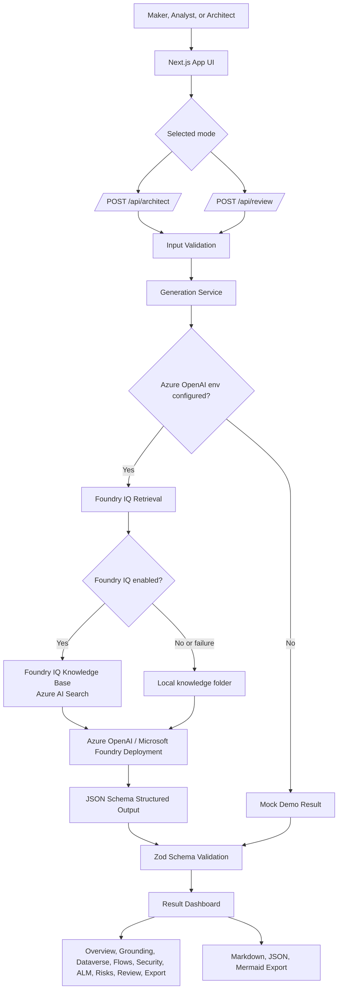

# Power Platform Architect Agent

**One-sentence pitch:** A Foundry-grounded AI web app that turns Power Platform requirements or existing designs into structured architecture blueprints, review findings, readiness scores, and exportable implementation guidance.

## Problem Statement

Power Platform makers, business analysts, and solution architects often start with incomplete requirements and must manually translate them into data models, app recommendations, Power Automate flows, security roles, ALM plans, risks, and implementation checklists. That process is time-consuming, inconsistent, and easy to under-scope, especially around security, environment strategy, flow ownership, licensing, and production readiness.

Power Platform Architect Agent accelerates that early architecture work while making the remaining human validation work explicit.

## Target Users

- Power Platform solution architects preparing initial solution designs
- Makers and business analysts who need structured architecture guidance
- Center of Excellence teams reviewing design quality and governance gaps
- Delivery teams preparing implementation handoff documents
- Hackathon judges or stakeholders evaluating solution feasibility

## Key Features

- **Generate Architecture mode**: Converts a business requirement into a Power Platform solution blueprint.
- **Solution Review Board mode**: Reviews an existing design and returns findings, top priority fixes, and readiness scoring.
- **Foundry IQ grounding**: Retrieves Power Platform guidance from a Foundry IQ knowledge base backed by Azure AI Search before generation or review.
- **Structured output**: Uses Zod schemas and Azure OpenAI structured JSON output for predictable rendering.
- **Dataverse schema guidance**: Tables, columns, relationships, keys, and auditing recommendations.
- **Power Automate design**: Triggers, numbered steps, connectors, error handling, retry policy, and ownership guidance.
- **Security model matrix**: Persona-based roles with allowed and restricted table privileges.
- **ALM checklist**: Environments, managed solution strategy, connection references, environment variables, deployment steps, and rollback plan.
- **Risk and readiness views**: Severity-grouped risks, mitigations, and category scores.
- **Mermaid architecture diagram**: Rendered in-app with source copy support.
- **Grounding transparency**: Shows whether the result was grounded by Foundry IQ, local knowledge fallback, mock data, or no grounding.
- **Export panel**: Copy or download Markdown, JSON, and Mermaid source, including grounding sources.
- **Demo fallback**: Uses mock results when Azure OpenAI environment variables are not configured, with a visible Demo Mode notice.
- **Responsible AI notice**: Reminds users to validate AI-generated architecture before production use.

## Demo Screenshots

> Placeholder: Add final screenshots before submission.

- `docs/screenshots/01-generate-architecture.png`
- `docs/screenshots/02-review-board.png`
- `docs/screenshots/03-dashboard-tabs.png`
- `docs/screenshots/04-export-panel.png`

## Demo Video

> Placeholder: Add the final demo video link before submission.

- Demo video: `https://<your-demo-video-link>`

## Architecture Diagram



## Tech Stack

- **Framework**: Next.js 16 App Router
- **Runtime UI**: React 19
- **Language**: TypeScript
- **Styling**: Tailwind CSS 4
- **Validation**: Zod
- **Structured output schema**: `zod-to-json-schema`
- **AI integration**: Azure OpenAI-compatible chat completions endpoint
- **Grounding**: Foundry IQ knowledge base backed by Azure AI Search, with local markdown fallback
- **Diagrams**: Mermaid
- **Icons**: Lucide React
- **Testing**: Vitest
- **Linting**: ESLint with Next.js config

## How GitHub Copilot Was Used

GitHub Copilot/Codex was used as an engineering pair throughout development to:

- scaffold the Next.js application
- generate TypeScript and Zod schemas
- create accessible React components
- build the mock dashboard
- implement Azure OpenAI API routes
- integrate Foundry IQ retrieval and local grounding fallback
- generate validation helpers
- create tests
- improve documentation
- debug TypeScript and build issues

All generated code was reviewed, validated, and adjusted to fit the project structure and Power Platform domain requirements.

## How Azure OpenAI, Microsoft Foundry, and Foundry IQ Are Used

The app uses Azure OpenAI through `lib/azureOpenAI.ts` and retrieves grounding context through `lib/foundryIQ.ts`:

- `generateArchitecture(requirement)` sends business requirements to Azure OpenAI.
- `generateReview(designText)` sends existing design text to the Solution Review Board prompt.
- Before the model call, both flows call `retrieveFoundryIQContext(...)`.
- If Foundry IQ is enabled, the app retrieves guidance from the configured knowledge base.
- If Foundry IQ is disabled or retrieval fails, the app uses concise local markdown guidance from the `knowledge/` folder.
- Retrieved grounding text is included in the prompt as the primary source of Power Platform guidance.
- Both flows use system prompts from `lib/prompts.ts`.
- Both flows request JSON schema structured output.
- Responses are parsed as JSON and validated with Zod schemas before rendering.
- Validated results are stamped with `groundingMode` and `groundingSources`.
- If Azure OpenAI environment variables are missing, the app falls back to mock demo data.

The expected Azure OpenAI endpoint is:

```txt
${AZURE_OPENAI_BASE_URL}/chat/completions
```

The request includes:

- `api-key` header
- configured deployment name as `model`
- system and user messages
- `response_format.type = "json_schema"`
- strict schema matching for architecture or review output

The Foundry IQ retrieve call uses:

- `FOUNDRY_IQ_SEARCH_ENDPOINT`
- `FOUNDRY_IQ_KNOWLEDGE_BASE`
- `FOUNDRY_IQ_API_VERSION`
- `FOUNDRY_IQ_AUTH_MODE`
- `AZURE_SEARCH_API_KEY` for API key mode, or `DefaultAzureCredential` for managed identity mode

The app does not invent source references. Source cards and Markdown exports show only the grounding sources returned by Foundry IQ, local fallback files, or mock data.

## Setup Instructions

1. Install dependencies:

```bash
npm install
```

2. Copy the environment template:

```bash
cp .env.example .env.local
```

3. Configure Azure OpenAI values in `.env.local` if available.

4. Configure Foundry IQ values if you have a knowledge base. Leave `FOUNDRY_IQ_ENABLED=false` or unset to use the local `knowledge/` folder as grounding fallback.

5. Start the development server:

```bash
npm run dev
```

6. Open the app:

```txt
http://localhost:3000
```

If Azure OpenAI is not configured, the app still runs with mock demo data. If Foundry IQ is not configured, real Azure OpenAI generation can still run with local knowledge grounding.

## Environment Variables

Create `.env.local` with:

```bash
AZURE_OPENAI_BASE_URL=https://<your-resource-name>.openai.azure.com/openai/v1
AZURE_OPENAI_API_KEY=<your-api-key>
AZURE_OPENAI_DEPLOYMENT=<your-model-deployment-name>

FOUNDRY_IQ_ENABLED=true
FOUNDRY_IQ_SEARCH_ENDPOINT=https://<your-search-service>.search.windows.net
FOUNDRY_IQ_KNOWLEDGE_BASE=power-platform-architecture-kb
FOUNDRY_IQ_API_VERSION=2026-05-01-preview
FOUNDRY_IQ_AUTH_MODE=api-key
AZURE_SEARCH_API_KEY=<your-search-key>
```

Notes:

- Do not commit `.env.local`.
- API keys are used only in server-side route handlers and server-side retrieval code.
- API errors are sanitized so Azure OpenAI and Azure AI Search keys are not returned to the browser.
- When any required Azure OpenAI variable is missing, the app returns a mock result and marks the response with `mockMode: true`.
- Foundry IQ can use `api-key` or `managed-identity` auth mode.
- Foundry IQ retrieval failures fall back to local knowledge files and are surfaced as grounding warnings.

## Local Development Commands

```bash
npm run dev
```

Run the production build:

```bash
npm run build
```

Start a built production app:

```bash
npm start
```

Run lint:

```bash
npm run lint
```

Run TypeScript checks:

```bash
npm run typecheck
```

## Testing Commands

Run the test suite:

```bash
npm test
```

Run tests in watch mode:

```bash
npm run test:watch
```

Current test coverage focuses on:

- Zod schema validation
- Mock result validation
- Markdown export content
- Foundry IQ request payload and grounding response parsing
- Requirement input validation
- Safe architecture result parsing

## Responsible AI and Safety Notes

- AI-generated architecture is a starting point, not a production approval.
- Security roles, table privileges, DLP policies, and environment access must be reviewed by qualified owners.
- Licensing notes should be validated against the organization's current Microsoft licensing agreement.
- Dataverse schema recommendations should be reviewed for data retention, privacy, compliance, and audit requirements.
- ALM recommendations should be aligned with the organization's release management standards.
- The app does not guarantee production readiness.
- The app avoids exact licensing prices and instead flags licensing uncertainty.
- Mock/demo output is clearly labeled when Azure OpenAI is not configured.
- Grounding sources are visible in the dashboard and exported Markdown.

## Known Limitations

- The app does not deploy Power Platform components.
- The app does not connect directly to Dataverse, Power Platform Admin Center, or Power Platform CLI.
- The app does not verify tenant-specific licensing, DLP policies, connector availability, or environment configuration.
- Generated Mermaid diagrams may need manual refinement for complex solutions.
- Structured AI output depends on model quality and prompt adherence.
- Foundry IQ retrieval depends on the configured knowledge base content and Azure AI Search response shape.
- Review mode evaluates text provided by the user; missing design details may produce assumptions rather than definitive findings.
- Authentication and persistent design history are not implemented.
- PDF export is intentionally deferred.

## Future Roadmap

- Add authentication and user-specific design history.
- Add Power Platform CLI export/import support.
- Add tenant-aware governance checks for environments, DLP, connectors, and solution layers.
- Add integration with Dataverse metadata APIs for existing environment review.
- Add comparison mode for multiple architecture options.
- Add richer report export formats, including PDF.
- Add accessibility and visual regression tests.
- Add organization-specific policy profiles for regulated industries.
- Add human approval workflow for architecture review signoff.
- Add automated ingestion tooling for the Foundry IQ knowledge base.

## Submission Checklist

- [ ] App runs locally with `npm run dev`
- [ ] `npm run lint` passes
- [ ] `npm run typecheck` passes
- [ ] `npm test` passes
- [ ] `npm run build` passes
- [ ] `.env.local` is not committed
- [ ] Demo Mode badge appears when Azure OpenAI env vars are missing
- [ ] Grounding tab shows Foundry IQ or local fallback sources
- [ ] Generate Architecture mode works
- [ ] Solution Review Board mode works
- [ ] Export buttons work for Markdown, JSON, and Mermaid source
- [ ] Mermaid diagram renders or shows fallback error
- [ ] Responsible AI notice is visible below the dashboard
- [ ] Demo screenshots are added
- [ ] Demo video link is added
- [ ] Judging checklist has been reviewed

## Project Structure

```txt
app/
  api/
    architect/route.ts   # Generate architecture API
    review/route.ts      # Solution review API
  page.tsx               # Main interactive experience
components/
  RequirementForm.tsx
  ResultDashboard.tsx
  ReviewFindingsView.tsx
  PriorityFixesView.tsx
  ...
lib/
  azureOpenAI.ts         # Azure OpenAI service wrapper
  foundryIQ.ts           # Foundry IQ retrieval and local grounding fallback
  schemas.ts             # Zod schemas and TypeScript types
  jsonSchema.ts          # JSON schemas for structured output
  prompts.ts             # System prompts
  validators.ts          # Input and result validation helpers
  exportMarkdown.ts      # Markdown/JSON export helpers
  mockResults.ts         # Demo fallback data
knowledge/
  *.md                   # Curated Power Platform guidance for Foundry IQ and local fallback
tests/
  *.test.ts
docs/
  architecture.md
  judging-checklist.md
```
