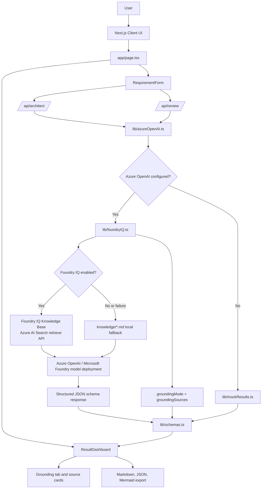
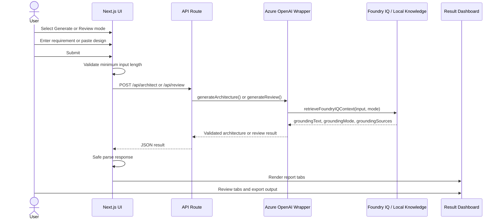
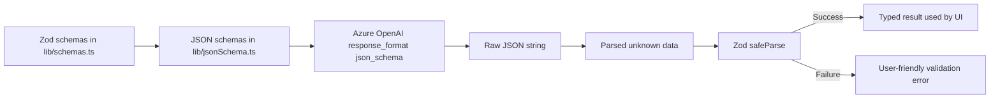
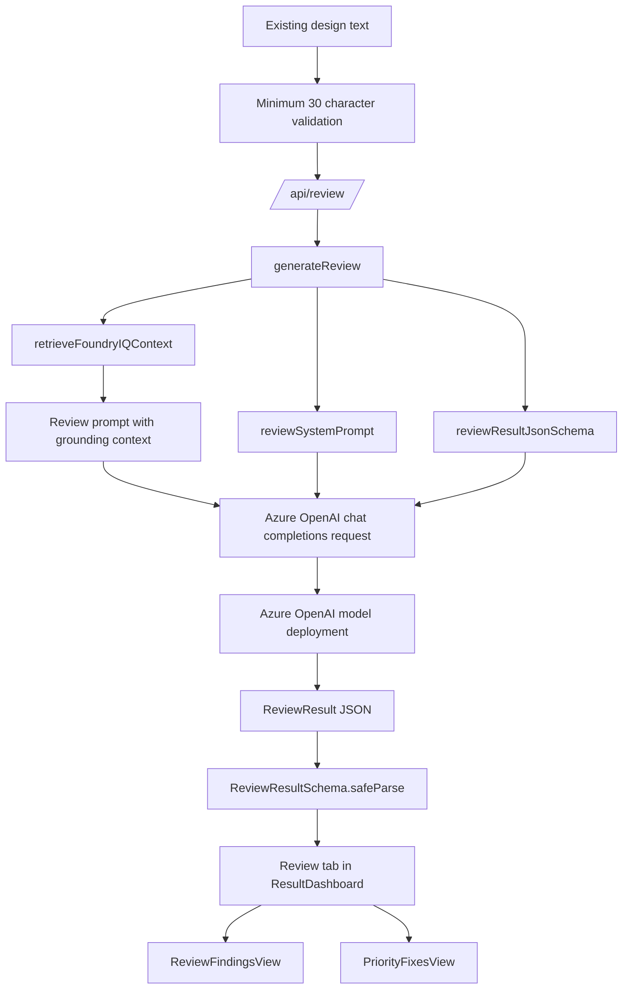
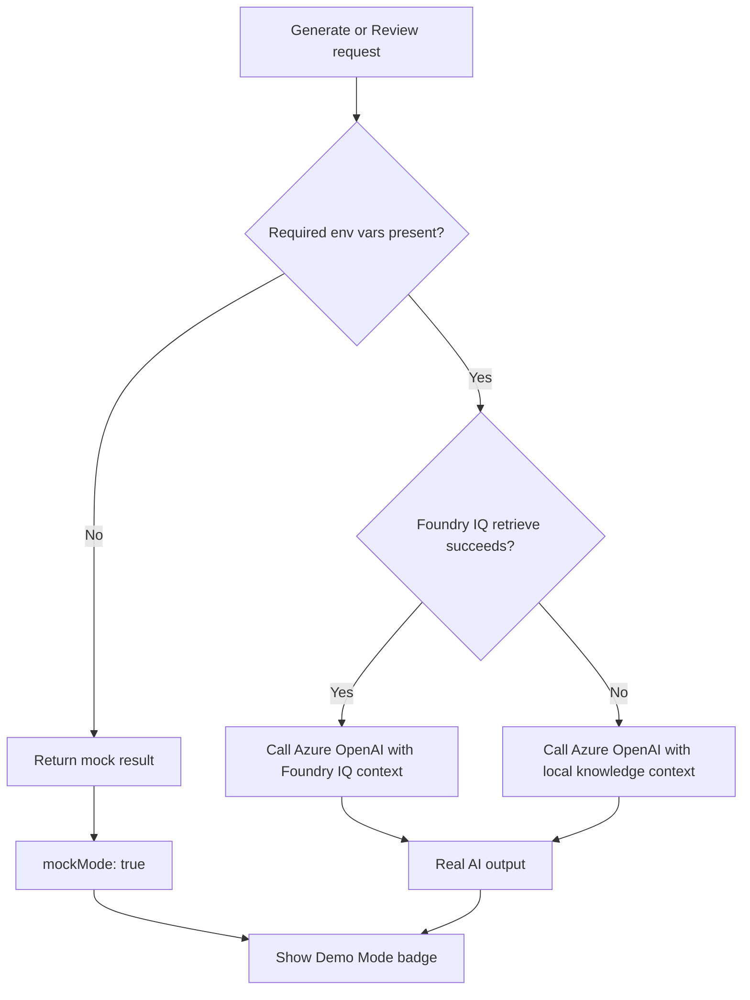
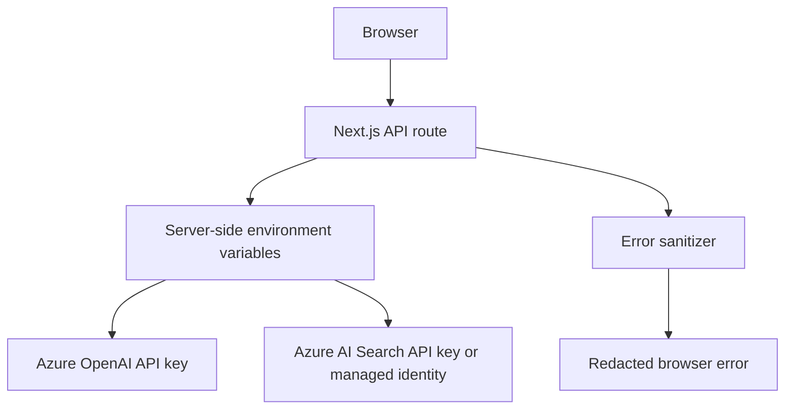
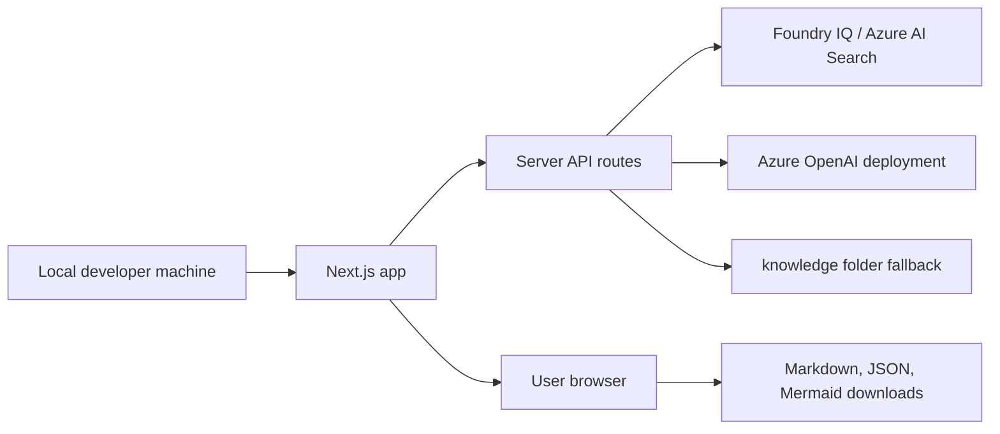

# Architecture

This document describes the architecture for the Power Platform Architect Agent hackathon project.

The app supports two workflows:

- **Generate Architecture**: turn a business requirement into a Power Platform solution blueprint.
- **Solution Review Board**: review an existing Power Platform design and return findings, priority fixes, and readiness scoring.

## High-Level Architecture



## Main Runtime Components

| Area | Files | Responsibility |
| --- | --- | --- |
| UI shell | `app/page.tsx` | Mode selection, API calls, loading/error/demo states, result rendering |
| Input | `components/RequirementForm.tsx` | Textarea, mode switch, example prompts, submit actions |
| Dashboard | `components/ResultDashboard.tsx` | Multi-tab report surface |
| Review UI | `ReviewFindingsView.tsx`, `PriorityFixesView.tsx` | Review Board findings and top fixes |
| AI service | `lib/azureOpenAI.ts` | Azure OpenAI calls, grounded prompt assembly, parsing, validation, mock fallback |
| Grounding | `lib/foundryIQ.ts`, `knowledge/*.md` | Foundry IQ retrieval, Azure AI Search auth, local knowledge fallback, grounding source metadata |
| Prompts | `lib/prompts.ts` | Generate and review system prompts |
| Schemas | `lib/schemas.ts`, `lib/jsonSchema.ts` | Zod validation, grounding metadata, and structured-output JSON schemas |
| Validation | `lib/validators.ts` | Input validation and safe result parsing |
| Mock data | `lib/mockResults.ts` | Demo fallback results |
| Export | `lib/exportMarkdown.ts`, `components/ExportPanel.tsx` | Markdown, JSON, and Mermaid output |

## User Flow



## AI Generation Flow

Generate Architecture mode sends a business requirement to `/api/architect`.

```mermaid
flowchart TD
    Requirement[Business requirement text] --> InputValidation[validateRequirementInput]
    InputValidation --> Route[/api/architect/]
    Route --> Generate[generateArchitecture]
    Generate --> Grounding[retrieveFoundryIQContext]
    Grounding --> Knowledge{Foundry IQ available?}
    Knowledge -->|Yes| FoundryRetrieve[Knowledge base retrieve API]
    Knowledge -->|No or failure| LocalFallback[Local knowledge markdown files]
    FoundryRetrieve --> GroundingText[Grounding context]
    LocalFallback --> GroundingText
    Generate --> Prompt[architectSystemPrompt]
    Generate --> Schema[solutionArchitectureJsonSchema]
    GroundingText --> Request[Azure OpenAI chat completions request]
    Prompt --> Request
    Schema --> Request
    Request --> Model[Azure OpenAI model deployment]
    Model --> RawJson[choices[0].message.content]
    RawJson --> Parse[JSON.parse]
    Parse --> Validate[SolutionArchitectureResultSchema.safeParse]
    Validate --> Result[SolutionArchitectureResult]
    GroundingText --> Result
```

The generated result includes:

- executive summary
- recommended app type
- Dataverse tables
- Power Automate flows
- security roles
- ALM plan
- licensing notes
- risks
- readiness score
- Mermaid architecture diagram
- implementation checklist
- follow-up discovery questions
- grounding mode and source references

## Foundry IQ Grounding Flow

Foundry IQ grounding is used before Azure OpenAI generation when Azure OpenAI is configured. The retrieved guidance is treated as the primary source for Power Platform architecture recommendations.

```mermaid
flowchart TD
    Input[Requirement or design text] --> Retrieve[retrieveFoundryIQContext]
    Retrieve --> Enabled{FOUNDRY_IQ_ENABLED == true?}
    Enabled -->|No| LocalDisabled[Read local knowledge folder]
    Enabled -->|Yes| Auth{Auth mode}
    Auth -->|api-key| ApiKey[Use Azure AI Search api-key header]
    Auth -->|managed-identity| ManagedIdentity[Use DefaultAzureCredential token]
    ApiKey --> KB[POST /knowledgebases/{kb}/retrieve]
    ManagedIdentity --> KB
    KB -->|Success| Parse[Parse retrieved documents, references, citations, chunks]
    KB -->|Failure| LocalError[Read local knowledge folder with warning source]
    Parse --> Grounded[groundingMode: foundry-iq]
    LocalDisabled --> Fallback[groundingMode: local-fallback]
    LocalError --> Fallback
    Grounded --> Prompt[Grounded model prompt]
    Fallback --> Prompt
```

The retrieve request body is version-aware:

- `2026-05-01-preview`: sends `messages`, `includeActivity`, `maxOutputDocuments`, and `maxOutputSize`.
- `2026-04-01`: sends `intents`.
- The request never sends a top-level `query` property.
- The request does not send `outputMode`.

The result is stamped with:

- `groundingMode`: `foundry-iq`, `local-fallback`, `mock`, or `none`
- `groundingSources`: source type, title, reference, optional excerpt, and purpose

The dashboard includes a **Grounding** tab, and Markdown exports include grounding details.

## Schema Validation Flow

The app uses schema validation in two places:

1. **AI structured output schema** sent to Azure OpenAI.
2. **Runtime Zod validation** after JSON is returned.



Key schemas:

- `SolutionArchitectureResultSchema`
- `ReviewResultSchema`
- `DataverseTableSchema`
- `FlowSchema`
- `SecurityRoleSchema`
- `ALMPlanSchema`
- `RiskSchema`
- `ReadinessScoreSchema`
- `ReviewFindingSchema`
- `PriorityFixSchema`

## Review Board Flow

Solution Review Board mode sends an existing design to `/api/review`.



Review mode evaluates:

- data model quality
- Dataverse suitability
- security model
- ALM strategy
- environment strategy
- Power Automate reliability
- connection ownership
- licensing uncertainty
- scalability
- maintainability
- production readiness

## Fallback Mock Mode

The app has two fallback layers:

1. **Mock mode** when Azure OpenAI is not configured.
2. **Local grounding fallback** when Foundry IQ is disabled or retrieval fails but Azure OpenAI is configured.



Required Azure OpenAI variables for live model generation:

```bash
AZURE_OPENAI_BASE_URL
AZURE_OPENAI_API_KEY
AZURE_OPENAI_DEPLOYMENT
```

Optional Foundry IQ / Azure AI Search variables for remote grounding:

```bash
FOUNDRY_IQ_ENABLED
FOUNDRY_IQ_SEARCH_ENDPOINT
FOUNDRY_IQ_KNOWLEDGE_BASE
FOUNDRY_IQ_API_VERSION
FOUNDRY_IQ_AUTH_MODE
AZURE_SEARCH_API_KEY
```

If an Azure OpenAI variable is missing:

- `generateArchitecture()` returns `getMockArchitectureResult()`.
- `generateReview()` returns `getMockReviewResult()`.
- API routes add `mockMode: true`.
- The UI shows: `Demo fallback active — Azure OpenAI environment variables are not configured.`

If Foundry IQ is disabled or unavailable:

- `retrieveFoundryIQContext()` reads curated markdown from `knowledge/`.
- The generated result uses `groundingMode: "local-fallback"`.
- The Grounding tab and Markdown export include the local source references and warning if applicable.

Manual "Use demo result" buttons also use mock data, but they do not show the Azure fallback badge because no API fallback occurred.

## Security Considerations



Security practices in the app:

- Azure OpenAI API key is only read server-side.
- Azure AI Search API key or managed identity token is only used server-side.
- API keys are never sent to the browser.
- API failure messages are sanitized before returning to the client.
- Foundry IQ failures are logged server-side with status and response body, but not request headers or API keys.
- User input is validated before calling the generation layer.
- AI output is validated before rendering.
- Results are displayed as structured React content rather than injected HTML.
- Mermaid rendering includes fallback error handling.
- `.env.local` should not be committed.

Security guidance produced by the app is advisory. Actual Power Platform security must be validated against the tenant's:

- Dataverse roles
- business units and teams
- row and column security
- DLP policies
- connector policies
- environment maker permissions
- privileged connector usage

## Responsible AI Considerations

The app is explicitly positioned as an architecture accelerator, not an approval engine.

Responsible AI controls:

- System prompts instruct the model not to guarantee production readiness.
- Prompts require assumptions, risks, and human validation notes.
- Licensing prompts prohibit exact invented prices.
- Readiness scores are framed as review signals, not certification.
- The UI includes a Responsible AI notice below the dashboard.
- Mock mode is labeled when Azure OpenAI is not configured.
- Grounding mode and grounding sources are visible in the UI and exports.
- If grounding is insufficient, prompts require assumptions or follow-up questions instead of invented guidance.
- Zod validation prevents malformed model output from being treated as valid.

Human review is required for:

- security model
- licensing
- data retention and compliance
- ALM and rollback strategy
- integration reliability
- production support ownership
- tenant-specific governance policies

## Known Limitations

- The app does not deploy Power Platform components.
- The app does not connect to Dataverse metadata APIs.
- The app does not inspect a tenant's real DLP policies, environments, or connector inventory.
- The app does not validate licensing entitlements.
- The app does not authenticate users or persist design history.
- The app does not guarantee model output accuracy.
- Foundry IQ grounding quality depends on knowledge base coverage and retrieval quality.
- If Foundry IQ retrieval fails, the app falls back to local guidance instead of blocking the demo.
- Mermaid diagrams may need manual cleanup for complex systems.
- Review quality depends on the completeness of the design text provided by the user.
- PDF export is intentionally out of scope for the current demo.
- The mock fallback is static and intended for demo continuity only.

## Deployment View



For local development:

```bash
npm install
cp .env.example .env.local
npm run dev
```

For validation:

```bash
npm run lint
npm run typecheck
npm test
npm run build
```
